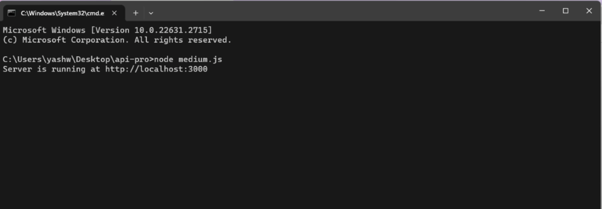
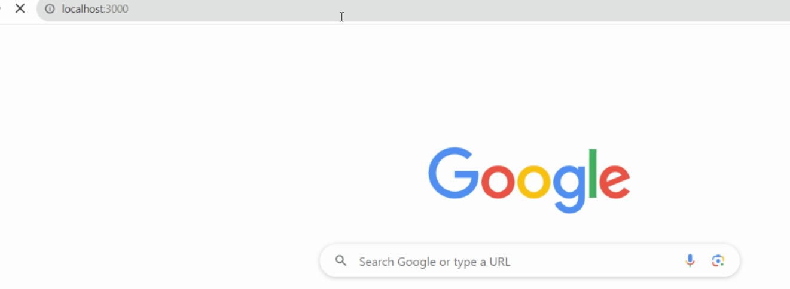
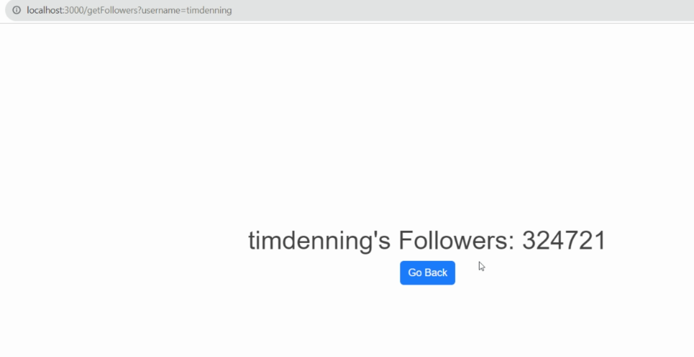

# Medium-Followers-Live-Count

Medium followers live count using a username created using JavaScript

This is a simple web application built with Node.js and Express that fetches the number of followers for a given Medium username.

# I forked this code: 

https://gist.github.com/newhouse/843c444ddefe084ea7f01603627dbcfd

## Prerequisites

Before running this application, 

ensure that you have Node.js and git bash installed on your machine.

## Installation

1. Clone the repository to your local machine:

git clone https://github.com/your-username/medium-followers-web-app.git

 # Navigate to the project directory:

 cd medium-followers-web-app

Install dependencies:

npm install

npm install express

npm install lodash

npm install request-promise

## Usage

Start the application:

node medium.js

# If you input incorrect text in the search box, the output will be as follows:

Error: SyntaxError: Unexpected token < in JSON at position 0

# Open your web browser and go to http://localhost:3000.

# Enter a correct Medium username (not name) in the provided form, then click "Get Followers" to see the number of followers for that user. After searching for one username, you can change the username in the site title to view the followers count for another user.

http://localhost:3000/getFollowers?username=MediumStaff

now replace MediumStaff with other username in site title...

𝙏𝙝𝙞𝙨 𝙞𝙣𝙛𝙤𝙧𝙢𝙖𝙩𝙞𝙤𝙣 𝙞𝙨 𝙤𝙣𝙡𝙮 𝙛𝙤𝙧 𝙚𝙙𝙪𝙘𝙖𝙩𝙞𝙤𝙣al 𝙥𝙪𝙧𝙥𝙤𝙨𝙚 𝙖𝙣𝙙 𝙬𝙚 𝙖𝙧𝙚 𝙣𝙤𝙩 𝙧𝙚𝙨𝙥𝙤𝙣𝙨𝙞𝙗𝙡𝙚 𝙛𝙤𝙧 𝙖𝙣𝙮 𝙠𝙞𝙣𝙙 𝙤𝙛 𝙞𝙡𝙡𝙚𝙜𝙖𝙡 𝙖𝙘𝙩𝙞𝙫𝙞𝙩𝙮 𝙙𝙤𝙣𝙚 𝙗𝙮 𝙩𝙝𝙞𝙨 𝙩𝙤𝙤𝙡.
